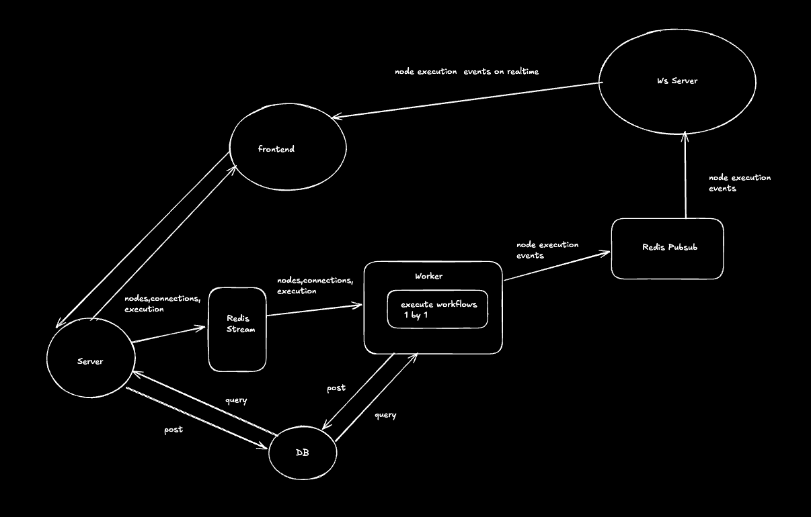

# W8W

**W8W** is a powerful workflow automation platform for modern teams.  
It lets you connect triggers (like webhooks) to actions (like Gemini, ResendEmail, Telegram, w8w forms etc.) and automate tasks visually.

---

## Architecture Diagram


## Features

- **Visual Workflow Builder:** Create and manage workflows with a drag-and-drop interface using [React Flow](https://reactflow.dev/).
- **Multiple Triggers:** Start workflows with webhooks or manual triggers.
- **Rich Actions:** Integrate with Gemini (powered by [LangChain](https://js.langchain.com/)), Resend Email, Telegram, and more.
- **Credential Management:** Securely store and manage API keys and credentials.
- **Execution History:** Track workflow runs and view logs.
- **Dark/Light Theme:** Modern, responsive UI with theme support.
- **Real-Time Execution Viewer:** Track workflow execution live with WebSockets and Redis Pub/Sub.
- **Built with Bun, React, TypeScript, Prisma, Zod, TanStack Query, Zustand,Express,Redis,Websockets**

---

## Tech Stack

- [Bun](https://bun.sh) - Fast JS runtime
- [React](https://react.dev) + [Vite](https://vitejs.dev)
- [React Flow](https://reactflow.dev/) - Visual node-based workflow builder
- [Zustand](https://zustand-demo.pmnd.rs/) - State management
- [TanStack Query](https://tanstack.com/query/latest) - Data fetching/caching
- [LangChain.js](https://js.langchain.com/) - LLM orchestration for Gemini actions
- [Prisma](https://www.prisma.io/) - ORM
- [Zod](https://zod.dev/) - Schema validation
- [Express](https://expressjs.com/) - Backend API
- [Redis Streams](https://redis.io/docs/latest/develop/data-types/streams/) - Server-to-worker workflow queue
- [WebSockets](https://developer.mozilla.org/en-US/docs/Web/API/WebSockets_API) - Real-time client updates
- [Redis Pub/Sub](https://redis.io/docs/latest/develop/pubsub/) - Live workflow event propagation


---

## Project Structure

```
apps/
  web/        # React frontend (Vite, React Flow, TanStack Query, Zustand)
  server/     # Express backend (Prisma, Zod, LangChain, REST API, Redis Streams)
  worker/     # Handles workflows (LangChain for Gemini, Resend for email, Telegram, consumes Redis Streams)
packages/
  db/         # Prisma schema and generated client
  shared/     # Shared types and Zod schemas
```


---

## Usage

- **Create Workflows:** Add triggers and actions, connect them visually with React Flow, and save.
- **Manage Credentials:** Add, edit, and delete API keys for integrations.
- **Run Workflows:** Trigger manually or via webhook.
- **View Executions:** See past runs and debug with logs.
- **Distributed Execution:** Workflows are queued via Redis Streams and processed by workers for scalability and reliability.
- **Live Monitoring:** Watch nodes start, succeed, or fail in real time as workflows run.


---

## Development

- **Install:** `bun install`
- **Dev server:** `bun run dev` (in `apps/web` or `apps/server` or `apps/worker`)
- **Build:** `bun run build`
- **Lint:** `bun run lint`

---

## License

MIT

---

> This project was created using `bun init` in bun v1.2.16.  
> [Bun](https://bun.sh) is a fast all-in-one JavaScript runtime.